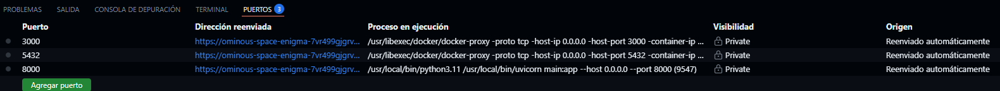
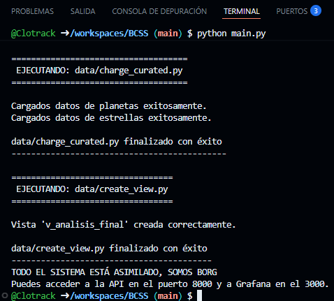
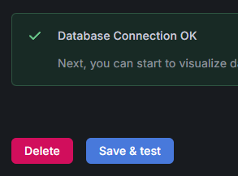
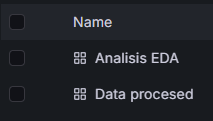
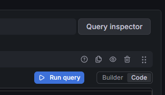
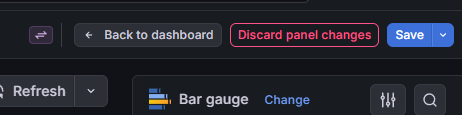
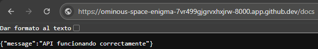
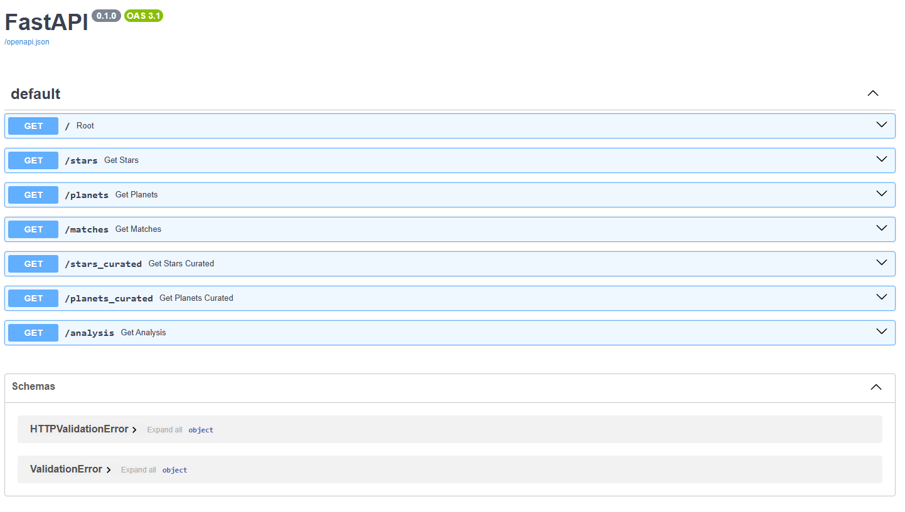
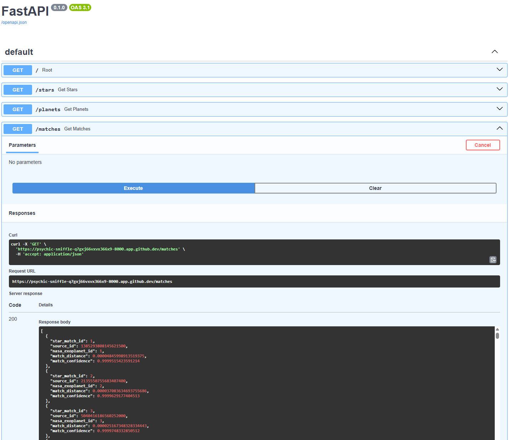

# BCSS
Clasificador de sistemas estelares (Borg)

## Proyecto Big Data - Manual de Instalación y Manual de Uso

Bienvenido al repositorio del proyecto BCSS.  
Este entorno ha sido diseñado para facilitar la puesta en marcha tanto en entorno local como mediante GitHub Codespaces, utilizando contenedores Docker para garantizar una instalación rápida, reproducible y consistente.

## Índice

- [Tecnologías utilizadas](#-tecnologías-utilizadas)
- [Estructura del proyecto](#-estructura-del-proyecto)
- [Instalación del proyecto](#-instalación-del-proyecto)
- [Manual de Usuario](#-manual-de-usuario)
- [Tabla de comandos útiles](#️-tabla-de-comandos-útiles)
- [Acceso a Grafana](#-acceso-a-grafana)
- [API REST](#-api-rest)
- [Características](#-características)
- [Futuras mejoras](#-futuras-mejoras)
- [Autor](#-autor)

---

## Tecnologías utilizadas

- Docker & Docker Compose
- Python
- PostgreSQL
- Grafana
- FastAPI
- GitHub Codespaces

---

## Estructura del proyecto

```text
BCSS/
├── .devcontainer/
│   └── docker-compose.yml          # Creacion de los contenedores de Docker
├── api/
│   ├── Dockerfile
│   ├── main.py                     # API!!!!! archivo de inicio de la API!!!
│   └── requirements.txt
├── data/
│   ├── curated/                    # Datos finales listos para análisis
│   ├── processed/                  # Datos tras gaia_clean y nasa_clean
│   ├── raw/                        # Archivos CSV originales (sin procesar)
│   ├── createBBDD_estructure.py    # Crear estructura Base de datos 
│   ├── charge_curated.py
│   ├── charge_gaia.py
│   ├── charge_match.py
│   ├── charge_nasa.py
│   └── create_view.py
├── grafana/
│   ├── dashboards/                     # Ficheros de configuracion dashboard .json 
│   ├── provisioning/                 
│       ├── dashboard/dafoult.yaml      # Configurar rutas dashboard a contenedor grafana
│       └── datasources/postgres.yaml   # Configurar conexion Base de datos a grafana
├── notebook/                           # Descatalogado con script main.py
│   ├── gaia_clean.ipynb
│   ├── nasa_clean.ipynb
│   ├── planets_eda.ipynb
│   └── stars_eda.ipynb
├── script/
│   ├── download_nasa.py
│   ├── gaia_clean.py
│   ├── nasa_clean.py
│   ├── planets_eda.py
│   └── stars_eda.py
├── test/                           # Pruebas unitarias del sistema
│   └── gaia_clean_test.ipynb   
├── .gitignore
├── LICENSE
├── main.py                         # Orquestador principal del pipeline
├── README.md
└── requirements.txt                # Requerimientos de librerias y utilidades para todo el sistema
```

---

## Manual de instalación 

### 1. Instalación del proyecto

- Acceder al directorio .devcontainer
Tanto si trabajamos en local como en Codespaces, el primer paso será movernos desde la terminal a la carpeta .devcontainer.
    
`cd .devcontainer`

### 2. Levantar los contenedores Docker

Ejecutamos el siguiente comando:

`docker-compose up`

Este proceso puede tardar varios minutos la primera vez, ya que Docker debe:

* Descargar imágenes
* Instalar dependencias
* Crear contenedores
* Configurar servicios
* Inicializar Grafana y la base de datos

Cuando finalice, veremos varios puertos abiertos en la pestaña Ports y los servicios estarán operativos.



---

### Tabla de comandos útiles

| Comando                           | Descripción                                   |
| --------------------------------- | --------------------------------------------- |
| `cd .devcontainer`                | Acceder al directorio de configuración Docker |
| `docker-compose up`               | Levantar todos los contenedores               |
| `docker-compose down`             | Detener los contenedores                      |
| `docker-compose down -v`          | Eliminar contenedores y volúmenes             |
| `docker ps`                       | Ver contenedores activos                      |
| `docker logs <contenedor>`        | Ver logs de un contenedor                     |
| `docker restart <contenedor>`     | Reiniciar un contenedor                       |
| `docker images`                   | Ver imágenes Docker instaladas                |
| `py main.py`                      | Ejecutar el proyecto en Windows               |
| `python main.py`                  | Ejecutar el proyecto en Linux/Codespaces      |
| `pip install -r requirements.txt` | Instalar dependencias manualmente             |
| `git status`                      | Ver estado del repositorio                    |
| `git pull`                        | Actualizar el proyecto                        |
| `git clone <url>`                 | Clonar el repositorio                         |

---

### Ejecutar el script principal

Una vez desplegados los contenedores:

1. Abrimos una nueva terminal
2. Nos aseguramos de estar en la carpeta raíz del proyecto
3. Ejecutamos el script principal

Windows: 

`py main.py`

Linux / Codespaces:

`python main.py`

Cuando el script termine correctamente, el sistema estará completamente operativo.



---

### Solución a posibles problemas

| Comando                               | Descripción                                   |
| ------------------------------------- | --------------------------------------------- |
| `docker logs <nombre_del_contenedor>` | Ver logs de un contenedor                     |
| `docker-compose down -v`              | Reiniciar completamente el entorno            |
| `docker-compose down`                 | Detener los contenedores                      |

---

## Manual de Usuario

Este apartado describe el uso de:

* Grafana
* API REST del proyecto

Se asume que:

* ✔️ Los contenedores Docker están funcionando
* ✔️ El script main.py se ha ejecutado correctamente

### Acceso a Grafana

### 1. Abrir la pestaña de puertos

En VSCode / Codespaces, accedemos a la pestaña: 'PORTS'

Buscamos el puerto '3000'


Y pulsamos el icono con forma de planeta 🌍 para abrir Grafana en el navegador.

### Inicio de sesión en Grafana

Las credenciales por defecto son:

| Usuario | Contraseña |
| ------- | ---------- |
| admin   | admin      |

Tras iniciar sesión:

* Ignoramos el aviso de seguridad
* Pulsamos Skip
* Cerramos el asistente de bienvenida

###  Configuración de la base de datos

Grafana puede arrancar antes que PostgreSQL y la conexión inicial puede no establecerse correctamente.

Para solucionarlo:

1. Ir al menú lateral izquierdo
2. Entrar en: 'Connections > Data Sources'
3. Seleccionar PostgreSQL
4. Pulsar: 'Save & Test'

Si todo es correcto aparecerá un mensaje verde confirmando la conexión.



---

### Dashboards

En el menú lateral izquierdo: 'Dashboards'

Encontraremos los cuadros de mando ya configurados:

* Datos procesados
* Datos EDA / Curados



Entramos en cualquiera de ellos y Al entrar por primera vez es posible que algunas gráficas aparezcan vacías o con errores.

Pasos para refrescar
1. Pulsar los tres puntos `⋮`
2. Seleccionar: 'Edit'
3. Pulsar boto ubicado junto al rango temporal: 'Refresh'

De no haberse visualizado aun los datos seguir con el siguiente paso sino pasar este suguiente paso.

Ejecutar consulta manualmente si los datos siguen sin aparecer, pulsar el botón azul que se encuentra abajo a la derecha: 'Run Query' 



Volver al Dashboard para regresar al cuadro de mando pulsando el boton de arriba a la izquierda: 'Back to Dashboard'



Repetir con cada grafica sin cargar.

---

### Acceso a la API

De la misma manera que con Grafana desde la pestaña Ports en la terminal de VSCode / Codespaces, accedemos a la pestaña: 'PORTS'

Buscamos el puerto '8000'


Y pulsamos el icono con forma de planeta 🌍 para abrir Grafana en el navegador.

Una vez en la web visualizaremos una ventana negra que nos avisa de que todo esta ok.

Para acceder a la documentación Swagger añadimos /docs al final de la URL de nuestro navegador.



Entraremos automáticamente en la documentación interactiva Swagger UI.

Desde ella podremos:

* Consultar endpoints
* Ejecutar peticiones
* Descargar datos JSON
* Explorar la base de datos





---

### Características
* API REST desarrollada con FastAPI
* Visualización de datos mediante Grafana
* Persistencia de datos con PostgreSQL
* Infraestructura basada en Docker
* Compatible con GitHub Codespaces
* Dashboards interactivos
* Arquitectura reproducible y portable

---

### Futuras mejoras
* Aplicar MinIO como Data Lake
* Dashboards interactivos
* Desarrollar automatismo con tecnicas de machine learning
* News letter automatizada con descubrimientos relevantes periodicos
* Creación de web de caracter dibulgativo y automatizada con noticias

---

### Autor

Proyecto desarrollado como entorno de análisis y visualización Big Data utilizando tecnologías modernas de contenedorización y observabilidad. Presentado como Proyecto de final de 'curso de especialización en Big Data y Inteligencia Artificial' del centro educativo online 'Ilerna'. Desarrollado por `Clotrack` un servidor.